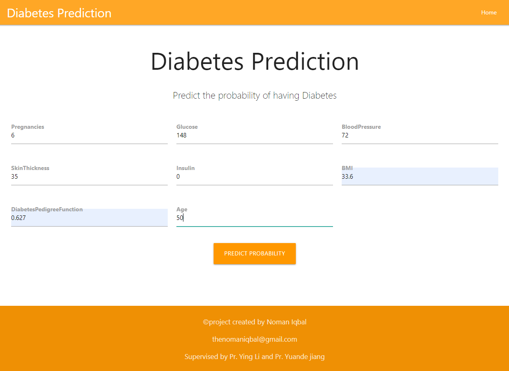
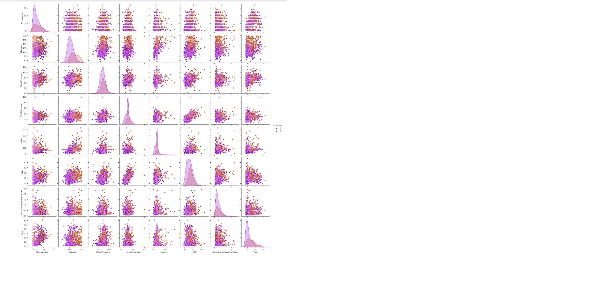
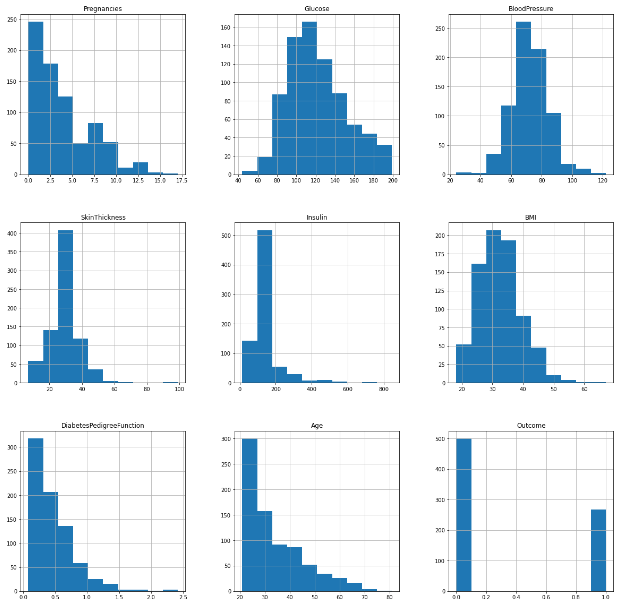

# Diabetes-prediction

<br />
<p align="center">
  <a href="https://github.com/thenomaniqbal/Diabetes-prediction">
    
  </a>

  <h3 align="center">Diabetes-prediction</h3>

  <p align="center">
    In this i've tried to predict the probability of a person having diabetes based on some data fields...
    <br />
    <a href="https://diabetesprediction404.herokuapp.com/"><strong>View Deployment On Heroku »</strong></a>
    <br />
    <br />
    <a href="https://github.com/thenomaniqbal/Diabetes-prediction">View Codes</a>
    ·
    <a>Report Bug -> thenomaniqbal@gmail.com</a>
    
  </p>
</p>


<!-- TABLE OF CONTENTS -->
## Table of Contents

* [About the Project](#about-the-project)
  * [Built With](#built-with)
* [Getting Started](#getting-started)
  * [Prerequisites](#prerequisites)
  * [Installation](#installation)
* [Contributers](#contributers)
* [Contact](#contact)


<!-- ABOUT THE PROJECT -->
## Project

 <a href="https://github.com/thenomaniqbal/">
        
  </a>

`thenomaniqbal`, `Diabetes-prediction`,  `thenomaniqbal@gmail.com`


### Built With

* [Python](python)
* [Flask](flask)


<!-- GETTING STARTED -->
## Getting Started

Clone the repo and extract it ....

### Prerequisites

This is the list of things you need to use the software and how to install them.
* Python
```
Version python 3.8 <
```
* Pandas
* sklearn
* numpy
* matplotlib
* flask

### Installation
 
1. Clone the repo
```
git clone https://github.com/thenomaniqbal/Diabetes-prediction.git

```
2. Install Python Libraries
```
pip install pandas,sklearn,numpy,matplotlib,flask

```

3. Required Imports:
```
import numpy as np
import pandas as pd
import matplolib.pyplot as plt
from flask import Flask,request, url_for, redirect, render_template
import pickle
```
## Contributers

thenomaniqbal, ismahanemerzuke

<!-- CONTACT -->
## Contact

Your Name - NomanIqbal

Project Link: [https://github.com/thenomaniqbal/Diabetes-prediction/](https://github.com/thenomaniqbal/Diabetes-prediction/)


## References
* Stackoverflow
* flask
